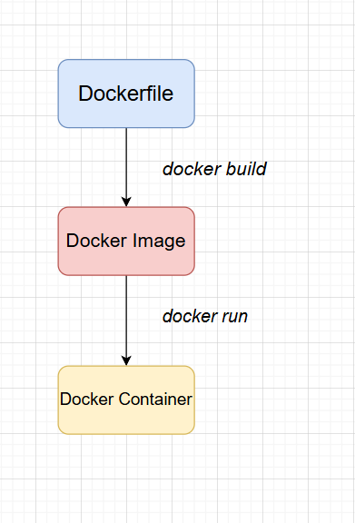
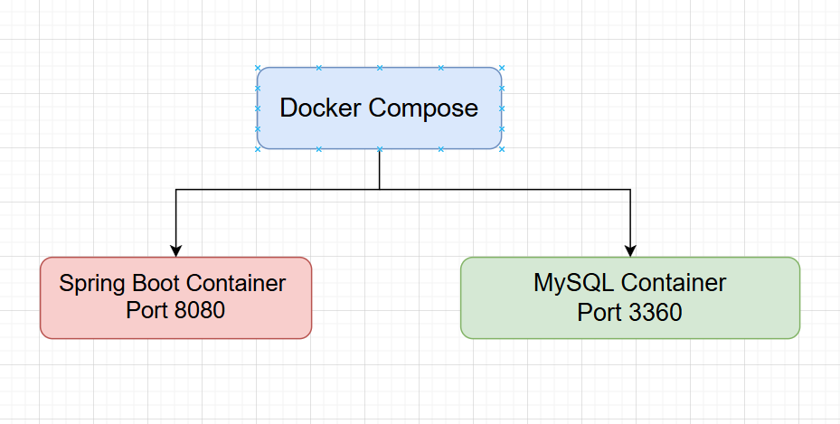

# Dockerfile and Docker Compose

## 1. Dockerfile

### What is Dockerfile?

Dockerfile is a configuration file that contains instructions to build a Docker Image.

A Docker Image contains everything required to run an application:

- Operating system environment
- Runtime
- Libraries
- Application source code
- Configuration

Flow:


---

## Dockerfile Example (Spring Boot)

```dockerfile
FROM eclipse-temurin:17-jdk
WORKDIR /app
COPY target/*.jar app.jar
EXPOSE 8080
ENTRYPOINT ["java","-jar","app.jar"]
```

---

## Dockerfile Explanation

### FROM

```dockerfile
FROM eclipse-temurin:17-jdk
```

Defines the base image.

Example:

The Spring Boot application requires Java 17, so we use an image that already contains Java.

```
Container
  Linux Environment
    Java 17
```

---

### WORKDIR

```dockerfile
WORKDIR /app
```

Creates and sets the working directory inside the container.

Example:

```
Container File System
:/
  app
    app.jar
```

All following commands will run inside **/app**.

---

### COPY

```dockerfile
COPY target/*.jar app.jar
```

Copies files from the host machine into the Docker image.

Example:

Host:

```
target/demo.jar
```

Container:

```
/app/app.jar
```

---

### EXPOSE

```dockerfile
EXPOSE 8080
```

Documents the port used by the application.

Spring Boot runs:

```
container:8080
```

To access from outside:

```
Host:8080
    |
    v
Container:8080
```

Using:

```bash
docker run -p 8080:8080 app
```

---

### ENTRYPOINT

```dockerfile
ENTRYPOINT ["java","-jar","app.jar"]
```

Defines the command executed when the container starts.

Equivalent command:

```bash
java -jar app.jar
```

---

# Build Docker Image

Run:

```bash
docker build -t spring-api .
```

Result:

```
Dockerfile

     |
     v

spring-api Image
```

Check:

```bash
docker images
```

---

# Run Container

```bash
docker run --name spring-api -p 8080:8080 spring-api
```

---

# 2. Docker Compose

## What is Docker Compose?

Docker Compose is a tool used to manage multiple Docker containers using one YAML configuration file.

Instead of running many commands:

```bash
docker run mysql
docker run mqtt
docker run spring-api
```

Use:

```bash
docker compose up
```

---

Example system:



# docker-compose.yml 
Example

```yaml
services:
  mysql:
    image: mysql:8
    container_name: mysql
    environment:
      MYSQL_ROOT_PASSWORD: 123456
      MYSQL_DATABASE: iot
    ports:
      - "3306:3306"
    volumes:
      - mysql_data:/var/lib/mysql

  api:
    build: .
    container_name: spring-api
    ports:
      - "8080:8080"
    depends_on:
      - mysql

volumes:
 mysql_data:
```

---

# docker-compose.yml 
Explanation


## services

```yaml
services:
```

Defines all containers managed by Docker Compose.


Example:

```
services

├── mysql
└── api
```

---

## image

```yaml
image: mysql:8
```

Uses an existing Docker image.

Docker will:

```
Search local image

        |
        v

Download from Docker Hub

        |
        v

Create container
```

---

## build

```yaml
build: .
```

Builds an image from Dockerfile.

Example:

```
Dockerfile

    |
    |
docker build

    |
    v

api image
```

---

## container_name

```yaml
container_name: mysql
```

Sets container name.

Example:

```bash
docker ps
```

Output:

```
NAME
mysql
spring-api
```

---

## environment

```yaml
environment:
 MYSQL_ROOT_PASSWORD: 123456
```

Sets environment variables inside the container.

Example MySQL:
```
Username: root
Password: 123456
```

---

## ports

```yaml
ports:
 - "8080:8080"
```

Maps ports:

```
Host Machine
8080
 |
 |
Docker Container
8080
```

Format:

```
HOST_PORT : CONTAINER_PORT
```

---

## volumes

```yaml
volumes:
 - mysql_data:/var/lib/mysql
```

Stores persistent data.

Without volume:

```
Remove container
        |
Database lost
```

With volume:

```
Container
    |
    v
Docker Volume
    |
    v
Data saved
```

---

## depends_on

```yaml
depends_on:
 - mysql
```

Defines startup order.

Example:

```
1. Start MySQL
2. Start API
```

---

# Docker Compose Commands


Start containers:

```bash
docker compose up -d
```


View containers:

```bash
docker compose ps
```


View logs:

```bash
docker compose logs -f
```


Restart:

```bash
docker compose restart
```


Stop:

```bash
docker compose down
```


Remove containers and volumes:

```bash
docker compose down -v
```

---

# Complete Deployment Flow

```
Spring Boot Source Code
          |
          |
mvn package
          |
          v
app.jar
          |
          |
Dockerfile
          |
          |
docker build

          |
          v
Docker Image

          |
          |
docker-compose.yml

          |
          |
docker compose up
          |
          v
Running Containers
```

